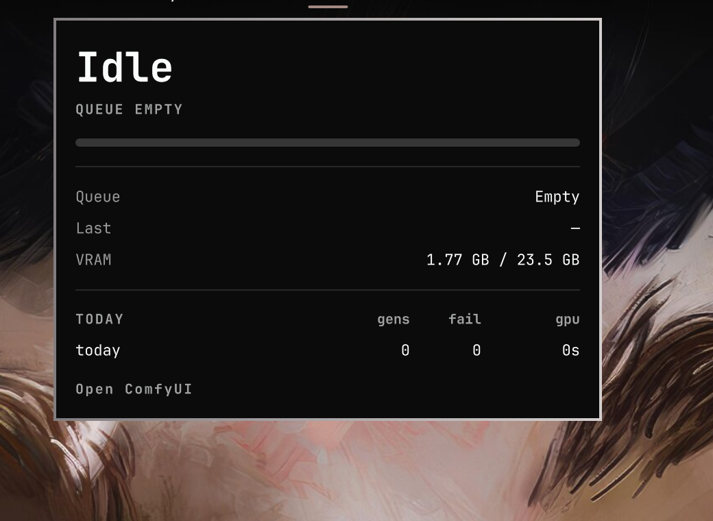
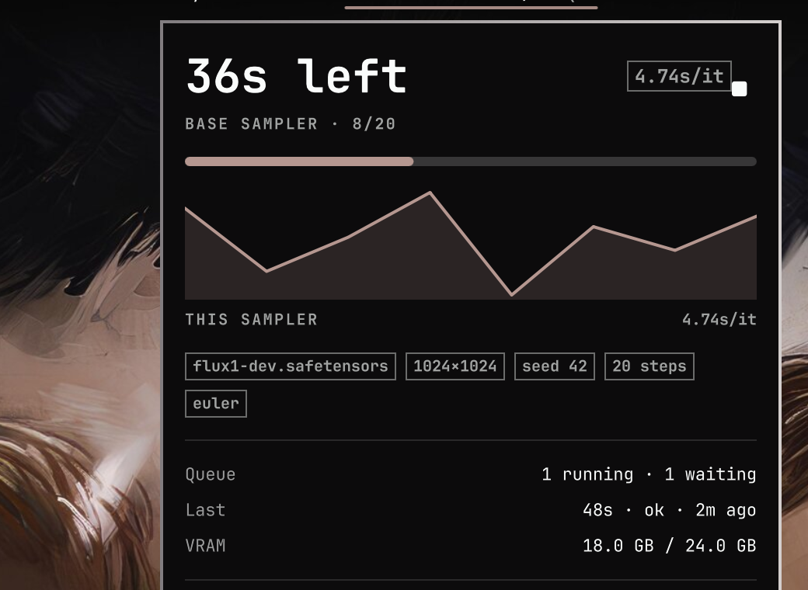
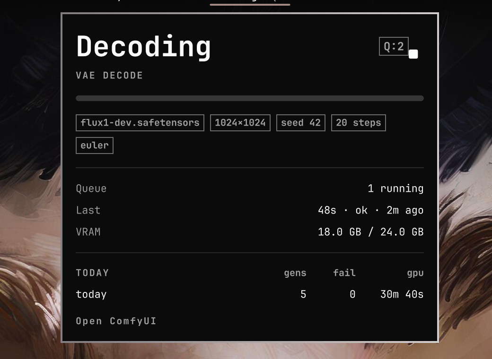
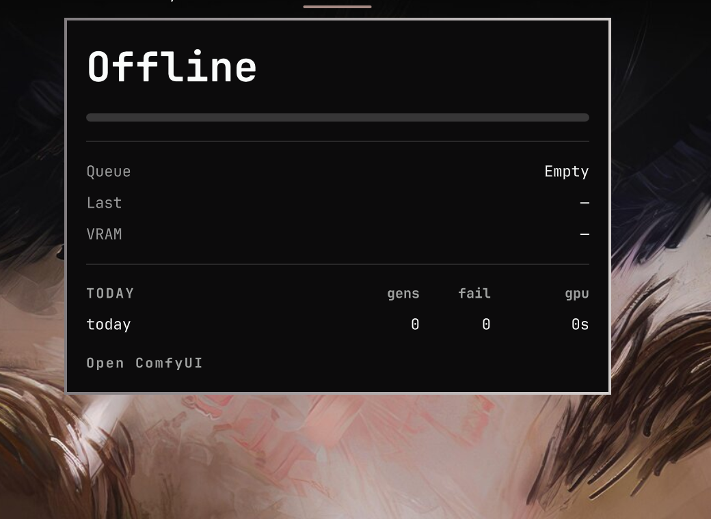

# omarchy-comfyui-status-plugin

Omarchy bar widget for [ComfyUI](https://github.com/Comfy-Org/ComfyUI). The bar shows **Idle** when the queue is empty, a sampler progress bar and **it/s** (or **s/it**) while sampling, **Working…** between sampler nodes, and **Offline** if the server is down.

Left-click opens a dashboard with this-sampler time remaining, the current node, a step-time sparkline, queue / last job / VRAM, checkpoint · size · seed facts, and today's session totals. Middle-click (or the panel stop button) posts `/interrupt`. Right-click opens the ComfyUI UI.

Progress, it/s, ETA, sparkline, facts, last job, and session totals come from the companion custom node [`comfyui-omarchy-status`](https://github.com/sshbrian/comfyui-omarchy-status). Without that node the widget still reports Offline / Idle / Working… from `GET /prompt`.

## Bar

**Idle**


**Sampling**


**Working**


**Offline**


## Dashboard

**Idle** — empty queue, last job, live VRAM, today's totals.



**Sampling** — ETA for this sampler, rate, sparkline, prompt facts, queue split.



**Working** — high-level phase (loading, decoding, saving, …), current node, interrupt.



**Offline** — leftover live-job fields are hidden; last job and today's totals stay.



The ETA is for the **current sampler only**, not the rest of the graph or queued prompts.

## Install

```bash
omarchy plugin add https://github.com/sshbrian/omarchy-comfyui-status-plugin.git --enable
```

Then install the companion node and restart ComfyUI:

```bash
cd /path/to/ComfyUI/custom_nodes
git clone https://github.com/sshbrian/comfyui-omarchy-status.git
```

Move the widget if you want:

```bash
omarchy bar move io.github.sshbrian.comfyui-status --section right
```

After updating the plugin, restart the Omarchy shell so QML and `Model.js` reload:

```bash
omarchy restart shell
```

## Settings

| Key | Default | Meaning |
| --- | --- | --- |
| `host` | `127.0.0.1` | ComfyUI HTTP host |
| `port` | `8188` | ComfyUI HTTP port |

| Input | Action |
| --- | --- |
| Left-click | Toggle the generation dashboard |
| Right-click | Open `http://<host>:<port>/` |
| Middle-click | Interrupt the running prompt |
| Stop button / `i` / `x` | Interrupt (while sampling or working) |
| Enter / Space / `o` | Open the ComfyUI UI |
| Esc | Close the dashboard |

## Remove

```bash
omarchy plugin remove io.github.sshbrian.comfyui-status
```

The companion node is a separate checkout under `ComfyUI/custom_nodes/`. Remove that folder and delete `${XDG_STATE_HOME:-$HOME/.local/state}/omarchy/comfyui-status.json` (and `comfyui-session.json` next to it) if you no longer want the snapshot. The bar ignores a snapshot older than 90 seconds and falls back to Offline / Idle / Working… from `GET /prompt`.

## Tests

```bash
node --test tests/test_model.js
```
